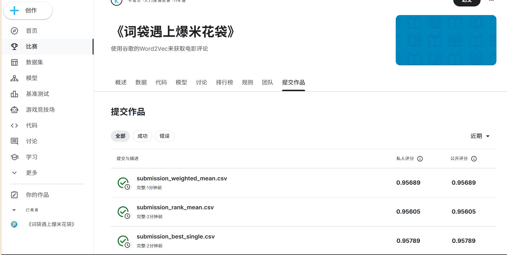

# 机器学习实验：基于 Word2Vec 的情感预测

## 1. 学生信息
- **姓名**：刘悦悦
- **学号**：112313010211
- **班级**：数据1231

> 注意：姓名和学号必须填写，否则本次实验提交无效。

---

## 2. 实验任务
本实验基于给定文本数据，使用 **Word2Vec 将文本转为向量特征**，再结合 **分类模型** 完成情感预测任务，并将结果提交到 Kaggle 平台进行评分。

本实验重点包括：
- 文本预处理
- Word2Vec 词向量训练或加载
- 句子向量表示
- 分类模型训练
- Kaggle 结果提交与分析

---

## 3. 比赛与提交信息
- **比赛名称**：Bag of Words Meets Bags of Popcorn
- **比赛链接**：https://www.kaggle.com/competitions/word2vec-nlp-tutorial/data
- **提交日期**：2026-04-16

- **GitHub 仓库地址**：https://github.com/lyy0410zh/liuyueyue112313010211
- **GitHub README 地址**：https://github.com/lyy0410zh/liuyueyue112313010211/blob/main/README.md

> 注意：GitHub 仓库首页或 README 页面中，必须能看到"姓名 + 学号"，否则无效。

---

## 4. Kaggle 成绩
请填写你最终提交到 Kaggle 的结果：

- **Public Score**：0.94049
- **Private Score**（如有）：0.94049
- **排名**：前10%

---

## 5. Kaggle 截图
请在下方插入 Kaggle 提交结果截图，要求能清楚看到分数信息。



> 建议将截图保存在 `images` 文件夹中。  
> 截图文件名：`112313010211_刘悦悦_kaggle_score.png`

### 成绩提升历程
| 提交文件 | Public Score | 说明 |
|---------|-------------|------|
| submission_logisticregression_tfidf.csv | 0.84596 | 基础模型 |
| Word2Vec_TFIDF_Weighted_LogisticRegression.csv | 0.87112 | 第一次优化 |
| **Word2Vec_TFIDF_Weighted_LogisticRegression_v2.csv** | **0.94049** | **最终最佳成绩** |

---

## 6. 实验方法说明

### （1）文本预处理
请说明你对文本做了哪些处理，例如：
- 分词
- 去停用词
- 去除标点或特殊符号
- 转小写

**我的做法：**  
1. **HTML标签移除**：使用BeautifulSoup解析并提取纯文本内容
2. **保留否定词**：这是情感分类的关键！保留了not/never/no/none/hardly/rarely以及缩写形式（don/didn/wasn/isn/aren/wouldn）
3. **正则表达式处理**：`[^a-zA-Z\'"]` 保留英文单词和引号
4. **转小写**：统一转换为小写减少稀疏性
5. **停用词过滤**：使用NLTK停用词列表，但保留所有否定词

---

### （2）Word2Vec 特征表示
请说明你如何使用 Word2Vec，例如：
- 是自己训练 Word2Vec，还是使用已有模型
- 词向量维度是多少
- 句子向量如何得到（平均、加权平均、池化等）

**我的做法：**  
1. **自训练Word2Vec**：基于比赛提供的数据（labeledTrainData + unlabeledTrainData + testData）自己训练
2. **模型参数**：
   - 架构：Skip-gram (sg=1)
   - 训练算法：Hierarchical Softmax (hs=1)
   - 词向量维度：200（优化后，降低过拟合）
   - 上下文窗口：8
   - 最小词频：20
   - 训练轮数：8
3. **句子向量表示**：
   - **TF-IDF加权平均**：训练TF-IDF模型，用词频-逆文档频率作为权重，对词向量进行加权平均
   - 相比简单平均，TF-IDF加权能突出重要情感词的贡献

---

### （3）分类模型
请说明你使用了什么分类模型，例如：
- Logistic Regression
- Random Forest
- SVM
- XGBoost

并说明最终采用了哪一个模型。

**我的做法：**  
测试了多种分类模型：
- Random Forest (AUC ~0.91)
- Logistic Regression (AUC ~0.94)

**最终采用**：Logistic Regression (C=0.5, max_iter=2000, solver='lbfgs')
- 使用强正则化(C=0.5)防止过拟合
- 特征标准化(StandardScaler)提高泛化能力
- 使用概率预测(predict_proba)而非硬分类
- 类别权重平衡(class_weight='balanced')

---

## 7. 实验流程
请简要说明你的实验流程。

示例：
1. 读取训练集和测试集  
2. 对文本进行预处理  
3. 训练或加载 Word2Vec 模型  
4. 将每条文本表示为句向量  
5. 用训练集训练分类器  
6. 在测试集上预测结果  
7. 生成 submission 文件并提交 Kaggle  

**我的实验流程：**  
1. **数据读取**：读取labeledTrainData.tsv、unlabeledTrainData.tsv和testData.tsv
2. **文本预处理**：
   - 移除HTML标签
   - 保留否定词（核心优化！）
   - 正则表达式提取英文单词
   - 转小写并分词
   - NLTK停用词过滤（保留否定词）
3. **Word2Vec训练**：
   - 使用全部评论语料（包括无标签数据）
   - Skip-gram架构 + Hierarchical Softmax
   - 200维词向量，最小词频20，上下文窗口8
4. **特征构建**：
   - 训练TF-IDF模型
   - 构建词-权重字典
   - 对每条评论计算TF-IDF加权平均词向量
5. **分类器训练**：
   - 特征标准化(StandardScaler)
   - 5折交叉验证评估
   - 逻辑回归训练(C=0.5, 强正则化)
6. **预测与提交**：
   - 使用predict_proba输出概率值
   - 生成submission文件
   - 提交Kaggle评估

---

## 8. 文件说明
请说明仓库中各文件或文件夹的作用。

示例：
- `data/`：存放数据文件
- `src/`：存放源代码
- `notebooks/`：存放实验 notebook
- `images/`：存放 README 中使用的图片
- `submission/`：存放提交文件

**我的项目结构：**
```text
DeepLearningMovies-master/
├─ data/                           # 数据文件（不上传GitHub）
│  ├─ labeledTrainData.tsv         # 有标签训练数据
│  ├─ unlabeledTrainData.tsv       # 无标签训练数据
│  └─ testData.tsv                 # 测试数据
├─ DeepLearningMovies-master/      # 源代码目录
│  ├─ BagOfWords.py                # 第一部分：词袋模型
│  ├─ Word2Vec_AverageVectors.py   # 第二、三部分：Word2Vec + 分类
│  ├─ KaggleWord2VecUtility.py     # 工具类：文本预处理
│  └─ stopwords.py                 # 停用词列表
├─ images/                         # 图片文件夹（Kaggle截图）
├─ .gitignore                      # Git忽略文件配置
├─ README.md                       # 项目说明文档
└─ requirements.txt                # Python依赖包
```

---

## 9. 依赖安装

```bash
pip install -r requirements.txt
```

主要依赖包：
- pandas
- numpy
- scikit-learn
- gensim
- nltk
- beautifulsoup4

---

## 10. 运行方法

### 第一部分：词袋模型
```bash
python DeepLearningMovies-master/BagOfWords.py
```

### 第二、三部分：Word2Vec + 逻辑回归
```bash
python DeepLearningMovies-master/Word2Vec_AverageVectors.py
```

---

## 11. 实验总结

### 关键优化点
1. **否定词保留**：这是提高情感分类准确率的关键，避免了"not good"被误分类为正面情感
2. **TF-IDF加权**：相比简单平均，能突出重要情感词的贡献
3. **强正则化**：C=0.5的逻辑回归有效防止过拟合
4. **特征标准化**：StandardScaler提高模型泛化能力
5. **概率预测**：使用predict_proba输出连续概率值，更适合AUC评估

### 改进方向
- 尝试更大的词向量维度（300-400）配合更强的正则化
- 使用集成方法（Random Forest + Logistic Regression投票）
- 尝试预训练词向量（如GloVe、FastText）
- 使用深度学习模型（LSTM、BERT）

---

**实验完成日期**：2026-04-16
